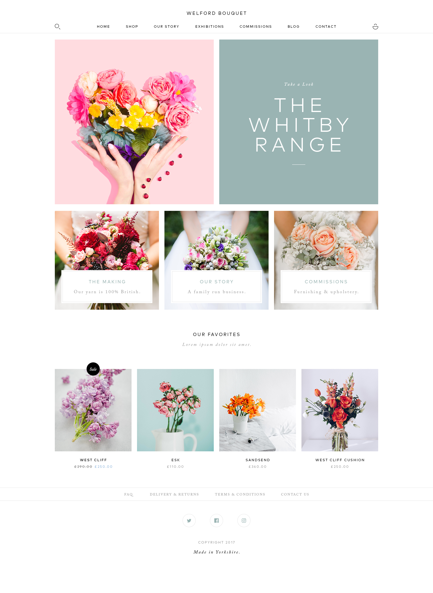

live server: https://michalsinu.github.io/welford-test/src/

## Guidance
- Build the design in HTML & CSS
- Design MUST be responsive
- You can use a font of your choosing
- The mobile layout is to your preference
- Links can be /#

## Bonus Points
- If Sass is used
- If a build tool is used (e.g gulp)

## Design

